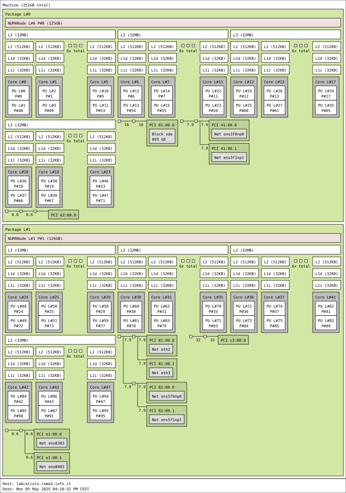

gnuplot 
---

Open the program (after main)
https://github.com/sunpho84/ising3/blob/14449f7214e4192eeef5d57e67884728d1e4486a/ising.cpp#L34-L38

update the plot after conf is updated
https://github.com/sunpho84/ising3/blob/14449f7214e4192eeef5d57e67884728d1e4486a/ising.cpp#L102-L109

close before the program ends
https://github.com/sunpho84/ising3/blob/14449f7214e4192eeef5d57e67884728d1e4486a/ising.cpp#L115-L119


timings
---

Define measurement and time difference
https://github.com/sunpho84/ising2/blob/c30de05d38626f877cc70bb3ef1f6bc1f5614c90/ising.cpp#L10-L24

Taking time
https://github.com/sunpho84/ising2/blob/c30de05d38626f877cc70bb3ef1f6bc1f5614c90/ising.cpp#L90

Measuring compute energy
https://github.com/sunpho84/ising2/blob/c30de05d38626f877cc70bb3ef1f6bc1f5614c90/ising.cpp#L112-L115

Printing
https://github.com/sunpho84/ising2/blob/c30de05d38626f877cc70bb3ef1f6bc1f5614c90/ising.cpp#L160-L161


plot 
----
```
g++ -o ising ising.cpp -DPLOT
```

parallel
--------
```
g++ -o ising ising.cpp -fopenmp
```


optimization 
-------
```
g++ -o ising ising.cpp -O3
```

choosing nthreads
-----------------
```
OMP_NUM_THREADS=2 ./ising
```

CPU structure
---
```
lstopo cpu.svg
```



OMP_verbosity and placement
-------------
```
export OMP_DISPLAY_AFFINITY=true
export OMP_DISPLAY_ENV=true
#OMP_NUM_THREADS=4 OMP_PROC_BIND=true ./ising L nConfs
#OMP_NUM_THREADS=4 OMP_PROC_BIND=true OMP_PLACES={0,48} ./ising L nConfs
#OMP_NUM_THREADS=4 GOMP_CPU_AFFINITY="0 1 2 3" ./ising L nConfs
OMP_NUM_THREADS=N GOMP_CPU_AFFINITY="$(echo {0..48})" ./ising L nConfs

```
in the list of places, the id of the core to be used is labelled with P#

passing L and nconfs to the program
------------------------
```
./ising L nconfs
```

Running different parameters
---

```
$ cat pars.txt #L nconfs nthreads
3 100 1
3 100 2
3 100 3
3 100 4
...

$ while read L nconfs nthreads;do OMP_NUM_THREADS=$nthreads ./ising $L $nconfs;done < pars.txt
```

or

```bash
for i in $(seq 1 16)
do
    OMP_NUM_THREADS=$i GOMP_CPU_AFFINITY="$(echo {1..48})" ./ising 300 1
done
```

